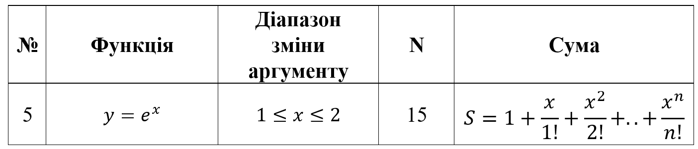
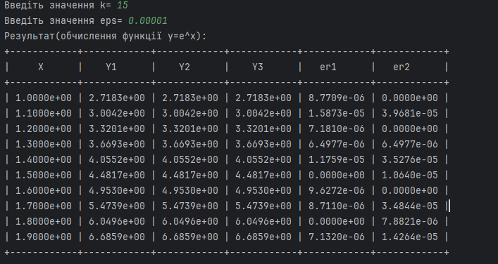
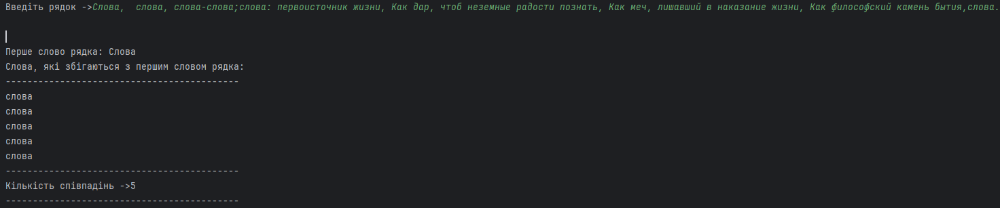

<h1 align="center">ЛАБОРАТОРНА РОБОТА №1</h1>
<h3 align="center">Тема: Введення у мову програмування Java. Віртуальна машина Java. Базові засоби мови Java.</h3>
<h3 align="center">Виконав:	Желобецький Арсеній Павлович; група 6.1221</h3>
<h3 align="center">Варіант №5</h3>

## Завдання 1:

Для x, що змінюється від a до b з кроком n, обчислити функцію f(x),
використовуючи її розкладання у степеневий ряд у трьох випадках:
1) для "точного" значення (за аналітичною формулою).
2) для заданого k (запитати в користувача);
3) для заданої точності e (запитати в користувача);

<h3 align="center">Варіант:</h3>

<h3 align="center">Результат:</h3>

## Завдання 2:

Вказано рядок, що складається із символів. Символи поєднуються в слова.
Слова один від одного відокремлюються одним або декількома пробілами або
іншими роздільними символами. Виконати введення рядка з консолі та обробку
рядка відповідно до свого варіанта.

<h3 align="center">Варіант:</h3>
5. Надрукувати всі слова, які збігаються з першим словом у рядку

<h3 align="center">Результат:</h3>

